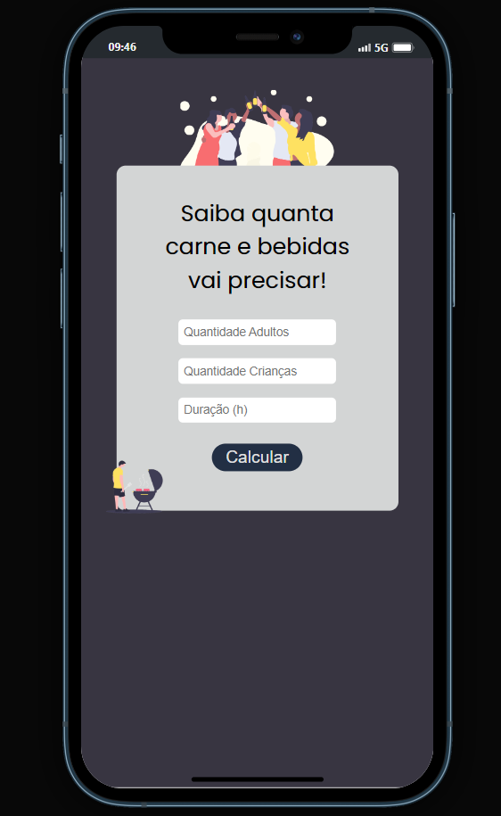

# Projeto Churrascômetro 🍖🍻
 Uma ferramenta prática para calcular a quantidade ideal de carne e bebidas para o seu churrasco, com base no número de adultos, crianças e a duração do evento. 👨‍🔧

 

### Preview Desktop / Mobile

#
### Funcionalidades
Cálculo para adultos:
- 1 adulto = 0.4kg de carne
- 10 latinhas de cerveja (269ml)
- 400ml de refrigerante

Cálculo para crianças:
- 1 criança = 0.2kg de carne
- 200ml de refrigerante

Eventos com duração de 5 horas ou mais:
- 1 adulto = 0.5kg de carne
- 17 latinhas de cerveja (269ml)
- 400ml de refrigerante

#
### Tecnologias utilizadas:
- HTML5: Estrutura do projeto.
- CSS3: Estilização e layout.
- JavaScript: Funcionalidades e interatividade.

 

LinkedIn: [linkedin.com/in/paulohrs01](https://www.linkedin.com/in/paulohrs01/)